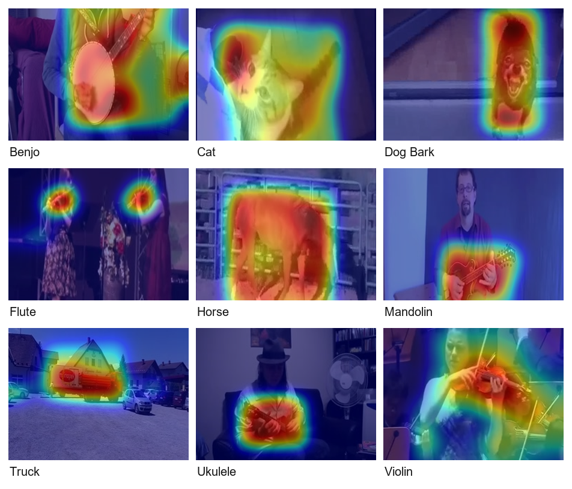
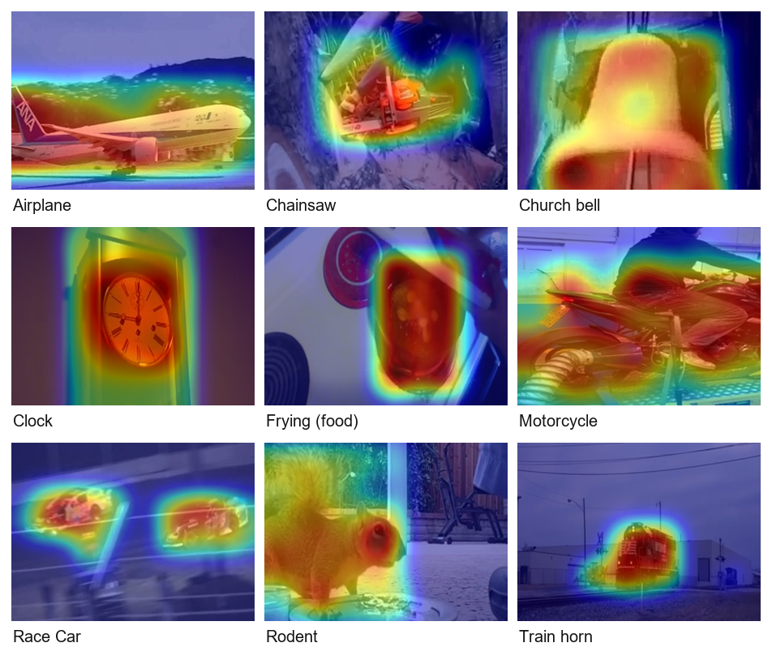
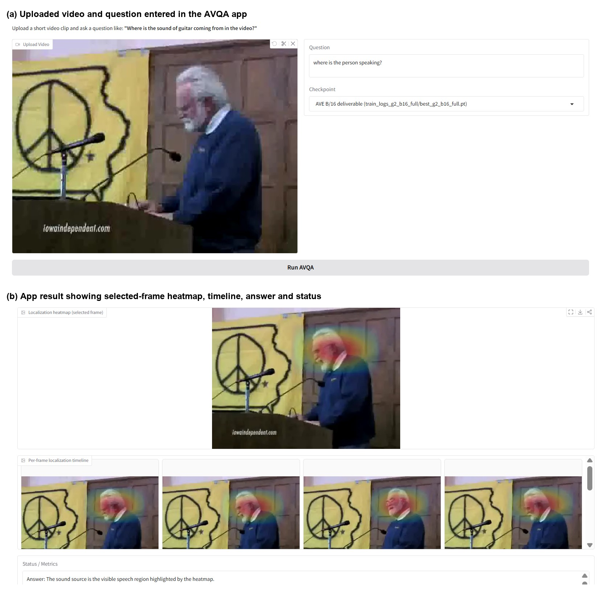
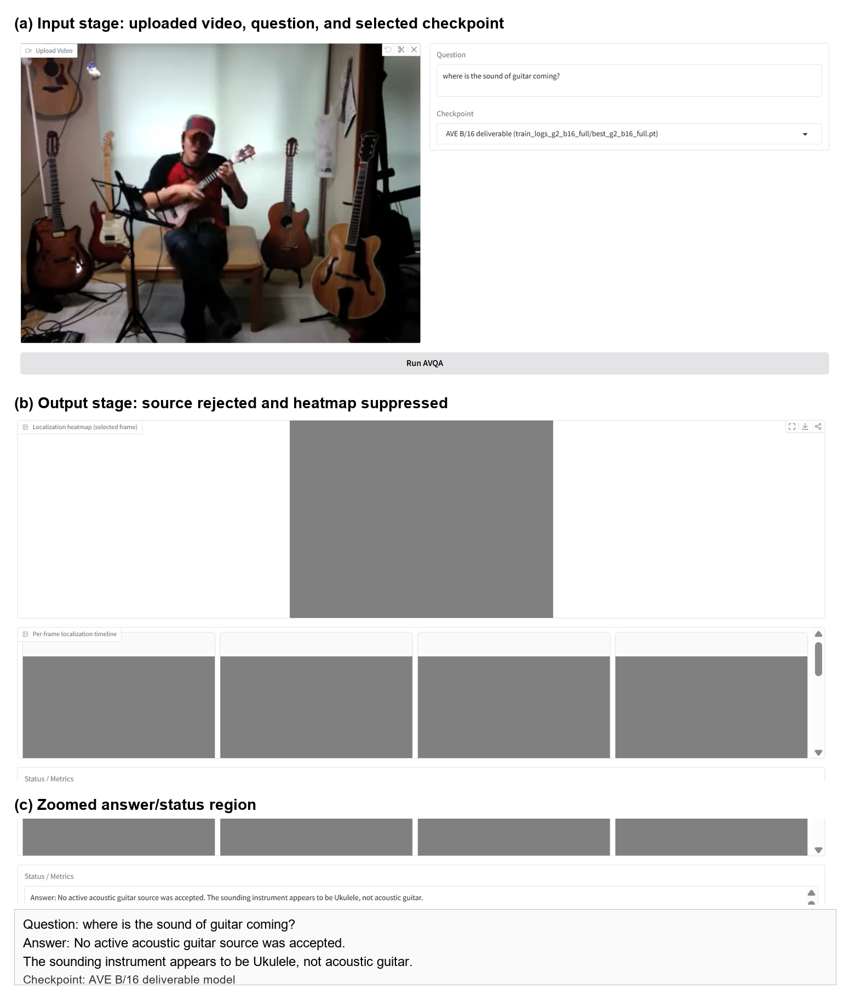
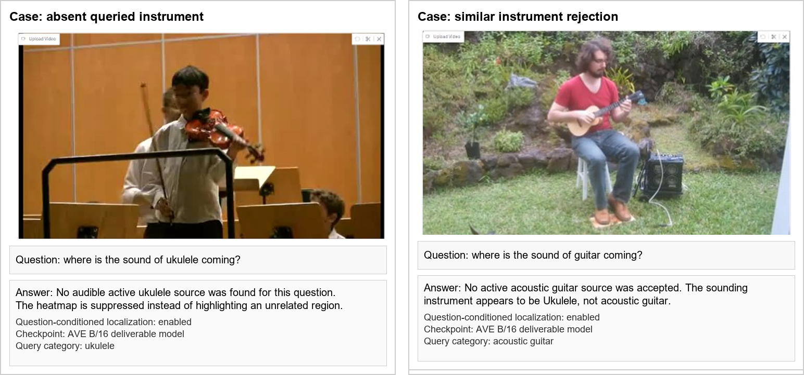

# Audio-Visual Question Answering for Self-Supervised Sound Source Localization

Ask a question about a video, such as *"Where is the sound of the guitar coming from?"*, and the system separates that sound from the audio mix, checks whether it is actually present, and highlights the region of the frame that produces it. It is trained without any manual location labels.

<!--This is my M.Tech project at the National Institute of Technology Calicut, guided by Dr. Saidalavi Kalady.

**Author:** Jaydip Rajeshbhai Movaliya (M241051CS)-->

---

## What it does

Given a video, its audio track and a natural-language question, the model produces four things:

1. The separated audio of the sound being asked about
2. A presence decision (is that sound really there or not)
3. A 14 x 14 localization heatmap over the frame
4. An answer category (top-1 / top-3 over 28 AVE classes)

The same clip can be queried for different sounds, and the output changes with the question. If the queried sound is not audible, the heatmap is suppressed instead of pointing at some unrelated object.

## How it works

The model is trimodal (video, audio, text) and trained with a mix-and-separate strategy: two clips are mixed, one category is used as the query, and the model has to recover that source and reject the other. No dense spatial annotations are needed.

- **Frozen encoders:** CLIP ViT-B/16 for video frames (8 frames per clip, 196 patch tokens each) and for the question text, and PANNs CNN14 for audio semantics. The mixture is also converted to an STFT spectrogram for separation.
- **Query fusion:** the text query is fused with the audio embedding, then a multiple-instance attention module scores how well each of the 196 patches matches the queried sound.
- **Four task heads**, trained jointly:

| Head | Role |
|---|---|
| U-Net separator (FiLM-conditioned) | Predicts a time-frequency mask for the queried source |
| AV correspondence localizer | Cosine similarity between the separated audio embedding and each patch, giving the heatmap |
| Presence head | Multi-label classifier on the PANNs mixture embedding; decides whether to localize at all |
| Answer head | Small MLP over visual, separated-audio and text features |

- **Loss:** a weighted sum of mask L1, SI-SDR, audio-language alignment, trimodal consistency, presence (BCE), localization and answer (cross-entropy) terms.
- **Inference:** the presence score gates the output. When a source is present, detector boxes and per-region motion are used only to refine the learned heatmap. Similar instruments are resolved by relative ranking, so asking for a guitar when a ukulele dominates reports a mismatch instead of highlighting the wrong instrument.

## Datasets

| Dataset | Use | Details |
|---|---|---|
| AVE (Audio-Visual Event) | Main training and evaluation | 4,143 ten-second YouTube clips, 28 event categories |
| SOLOS | Separation comparison only | 1,150 usable 10 s clips from 754 retrievable videos, 13 instruments (807 train / 112 val / 231 test) |

For SOLOS, only the videos that are still available on YouTube could be used, so the subset is smaller than the original release.

Evaluation on AVE uses 82 held-out videos, tested as 164 two-source mixtures.

## Results

**AVQA answering (AVE, 28 classes)**

| Method | Top-1 | Top-3 |
|---|---|---|
| Random | 0.034 | 0.103 |
| Audio-only | 0.829 | 0.927 |
| Visual-only | 0.037 | 0.110 |
| Ours (trimodal) | **0.951** | **0.971** |

Visual-only is close to random because a visible object is not necessarily making a sound.

**Audio separation (AVE, dB, higher is better)**

| NSDR | SDR | SIR | SAR | SI-SDRi |
|---|---|---|---|---|
| 5.35 | 4.85 | 7.19 | 13.20 | 5.02 |

**Comparison on SOLOS**

| Method | NSDR | SIR | SAR |
|---|---|---|---|
| VAST | 8.58 | 14.16 | 12.35 |
| Ours (SOLOS subset) | 6.79 | 8.64 | 14.80 |

The reference is stronger on NSDR and SIR. Our SAR is higher, meaning fewer artefacts in the separated audio. Our model was not pretrained on music and was trained only on the retrievable SOLOS subset, which explains part of the gap.

**Localization:** pointing accuracy of 0.844, measured as whether the heatmap peak falls inside an independent detector box.

## Example outputs

<!-- Add your images here, for example: -->
<p>
  
</p>
<p>
  
</p>
<p>
  
</p>
<p>
  
</p>
<p>
  
</p>

Edge-case behaviour we tested:

- **Absent source:** asking for a ukulele in a violin video gives no heatmap and a message saying no audible ukulele was found.
- **Similar instrument:** asking for a guitar when a ukulele is playing returns "No active acoustic guitar source was accepted. The sounding instrument appears to be Ukulele."
<!--
## Installation

Fill in with your actual environment details

```bash
git clone https://github.com/<your-username>/<your-repo>.git
cd <your-repo>
pip install -r requirements.txt
```

Pretrained weights and the extracted features are not included in the repository. 
Add download link or instructions

## Usage

 Replace with the actual commands from your code

Train:

```bash
python train.py --config <config-file>
```

Evaluate:

```bash
python evaluate.py --checkpoint <path-to-checkpoint>
```

Run the interactive app:

```bash
python app.py
```

Then upload a short video, type a question, pick a checkpoint and press **Run AVQA**. The app shows the heatmap for the selected frame, a per-frame localization timeline, and the answer with its status.
-->
## Limitations

- Trained at a modest scale with frozen encoders, so semantic coverage is limited by those encoders and the number of mixtures.
- Two cases are still hard: several instances of the same category in one frame, and a quiet source hidden under a much louder one.
- Visible-but-silent static objects are only partly handled.
- Separation quality is below a music-pretrained baseline.

## Future work

- Separating two identical objects when only one is sounding, using stronger object-aware supervision and motion cues
- Better presence detection when the target is buried under loud background sound
- Larger-scale or music-pretrained training with a stronger separator

## References

1. L. Zhu and E. Rahtu. Visually guided sound source separation and localization using self-supervised motion representations. WACV 2022.
2. P. Zhang et al. Audio-visual event localization with dual temporal-aware scene understanding and image-text knowledge bridging. Complex & Intelligent Systems, 2025.
3. T. Mahmud, Y. Tian, D. Marculescu. T-VSL: Text-guided visual sound source localization in mixtures. CVPR 2024.
4. R. Tan et al. Language-guided audio-visual source separation via trimodal consistency. CVPR 2023.
5. S. J. Um et al. Object-aware sound source localization via audio-visual scene understanding. CVPR 2025.

<!-- ## Acknowledgements

Thanks to Dr. Saidalavi Kalady for guidance throughout this project, and to the Department of Computer Science and Engineering, NIT Calicut.

## License

Add a license, e.g. MIT, or remove this section
-->
